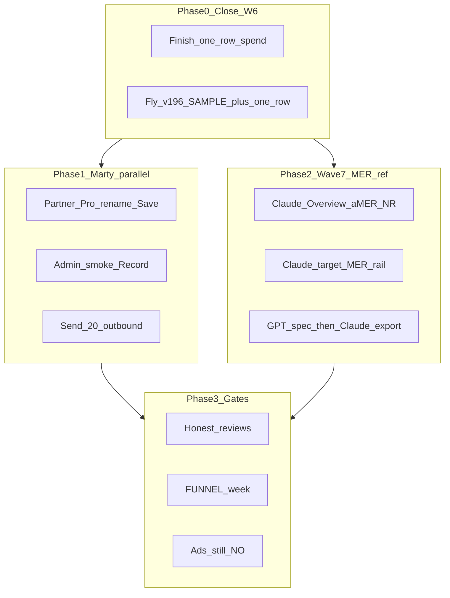

# Cursor Pro orchestration — Mcfly cash machine

**As of:** 2026-09-08 · Fly **v195** · SAMPLE share fix `ab11f70` **not yet on Fly** · one-row spend **dirty local** · ads **NO**

## Operating system

- One Conductor chat · ≤4 Task lanes · exclusive files · live probes beat PRs
- Models: [`MULTI_MODEL_CONDUCTOR.md`](./MULTI_MODEL_CONDUCTOR.md)
  - **Claude Opus** → Desk honesty / TTFV / MER craft
  - **GPT-5.6** → audits, checklists, ops cards, listing residue
  - **Composer** → merge, Fly, Pages verify
  - **Grok fleets** → banned for shipping
- Tree: `mcfly-analytics/` on `redesign/enterprise-desk` only
- Workers never `fly deploy` / Partner Submit

## Board

| Surface | State |
| --- | --- |
| Fly | v195 · need deploy for SAMPLE mailto + upcoming one-row |
| Site | v16 Harbor |
| Dirty | `spend-quick-day*`, `app.spend.tsx`, first-session, install-stickiness |
| Listing live | Still Pro + `(paid)` — paste ready |
| MER ref plan | [`mer_reference_wave_7`](file:///Users/martysmithson/.cursor/plans/mer_reference_wave_7_da8a5c67.plan.md) |

## Phase 0 — Close Wave 6 (do first)

1. Finish Claude one-row spend dirt (or resume lane) — exclusive spend/first-session files
2. Commit + **one Fly deploy** → v196 (SAMPLE share `ab11f70` + one-row)
3. Stamp smoke Record image
4. Queue hostile backlog (do **not** parallel with one-row on same files):
   - SAMPLE days counted as live spend coverage
   - Overview nav bounce / dead cold-empty
   - ReviewAsk App Bridge one-shot (hurts review flywheel)

## Phase 1 — Marty (parallel with Phase 2 after Phase 0)

| Action | Artifact |
| --- | --- |
| Partner 60s Save | [`LISTING_LIVE_PASTE.md`](./LISTING_LIVE_PASTE.md) |
| Admin smoke | [`money/SMOKE_APP_STORE_ADS.md`](./money/SMOKE_APP_STORE_ADS.md) |
| Outbound ×20 | [`money/OUTBOUND_MER_OPERATORS.md`](./money/OUTBOUND_MER_OPERATORS.md) |
| Optional | [`money/WEBHOOK_FAILURE_CARD.md`](./money/WEBHOOK_FAILURE_CARD.md) |

## Phase 2 — Wave 7 MER reference (after Phase 0 clean)

Black Clover Apps Script = **craft only**. No Domo / OAuth / CRM / Lucky clone. `read_all_orders` already unlocks OrderFact depth.

| Step | Model | DoD |
| --- | --- | --- |
| **A** Overview aMER + new/returning | Claude | cashActionReady; SAMPLE/backfill fail-closed |
| **B** Target MER rail + closed-day | Claude | Settings optional target vs actual Total ROAS |
| **C** Period ledger CSV export | GPT spec → Claude impl | Shopify sales SoT + spend channels |
| Digest stamp | GPT/Composer | Update `MER_APPS_SCRIPT_DIGEST.md` |

**One Desk Claude lane at a time** on overlapping routes. Sequence A→Fly→B→Fly→C→Fly.

## Phase 3 — Gates

Reviews after trusted Real ROAS · FUNNEL week paste · ads still **NO** until four greens.

## Capacity (how Pro allowance is spent)

| Slot | Claude | GPT | Conductor | Marty |
| --- | --- | --- | --- | --- |
| Now | Finish one-row | — | Commit/Fly v196 | Partner 60s + smoke |
| Next | Wave 7A Overview | Export DoD checklist | Deploy A | Outbound |
| Then | Wave 7B rail | Hostile coverage card | Deploy B | — |
| Then | Wave 7C export | Digest stamp | Deploy C | FUNNEL later |

## Success (honest)

- Cold → spend → Overview Total ROAS + aMER without SAMPLE leak
- Live listing plan **Mcfly Analytics**, no `(paid)`
- Smoke PASS on post-deploy Fly version
- **Not** success: Domo clone, ads burn, invented reviews
