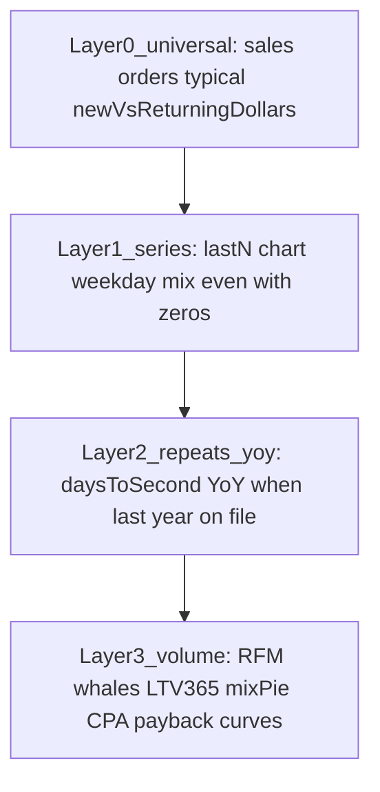
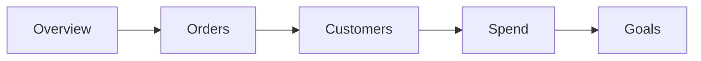

# Million-dollar tabs — 2026-09-19

**Status:** In flight (Conductor + 4 exclusive Desk lanes). Formula religion unchanged.

**Live until ship:** Fly 395 · site v29. Do not treat this file as already on Fly.

# Million-dollar plan: money-unique tabs, all-size stacks

Shopify Analytics skips this on purpose: median ticket, returning dollars, honest YoY, 30/90/365 from orders, and spend next to Shopify Total Sales are spreadsheet jobs. Polar charges from **$750/mo**, Triple Whale from **$219/mo**, Lifetimely taxes on order volume, Repeat Customer Insights sits at **$59+**. Mcfly’s **$39** bet is those jobs on a calm Admin desk with **no pixel**. Eleven equal pills do not make that product; they hide it.

This is the finished IA. Compact the **top bar**. Fold every board we already built. Stack each remaining page so a 12-order trial and a $5M+ operator use the **same five tabs**.

## Enterprise here does not mean Polar

Polar Core from $750, Lifetimely M **$149** (≤3,000 orders) up to **$999**, Triple Whale Foundation **$219**. Those products are “enterprise” because they **tax GMV, demand pixels, and ship a connector OS**. Their 1-stars are the same: numbers ≠ Shopify, day-one OAuth wall, bill jumps.

Mcfly enterprise is the **Black Clover operator desk** at flat $39:

- **One SKU.** Lifetimely gates Profit Agent / depth behind the order slider. We do the opposite: same five tabs, depth **stacked**, never paywalled.
- **One sales definition.** Shopify Total Sales. Polar/Northbeam tell merchants to compare to CSV because their book disagrees. We refuse a second revenue.
- **Certified, not attributed.** Yesterday / last N / MTD / QTD / YTD Total ROAS vs Settings target. Empty spend is **—**. Not first/last-touch ROAS.
- **Definition on the number.** Window lives on the card. DeskDrill already. Signal / Evidence / Next (FindingStrip, shareables). No Sidekick.
- **Phone Admin (~390px).** Five pills wrap. Dual 11-link `s-app-nav` plus pills is already a FAIL in the v339 craft audit.
- **SAMPLE = $5M craft canvas. Live thin = honest first fold.** Both must PASS. That is the QA bar, not “looks dense on Snowdevil only.”

Steal Black Clover **density** (grouped jobs, what-to-do Customers, order intelligence, explorer hover, certified chips). Do **not** paint SCOREBOARD / RETAIN / SPEND PLAN labels. Do **not** steal Amp mint-on-black marketing OS onto the Admin desk (operator wells stay white / navy / sky).

## The $750 product tree → five Mcfly tabs

Lifetimely’s analytics tree is five URLs: P&L · CAC/LTV · Journeys · Attribution · Custom dashboards. That **is** the money. Map it without their religion:

- **P&L / forecasts / COGS connectors** → **Refuse.** Goals (sales vs plan + LTV/returning-$ targets) is the operator substitute.
- **CAC & LTV** (cohorts, product/promo slices, payback) → **Customers** tab. Order-history 30/90/365, Product→LTV, Promo→LTV. Cash CAC / CPA **only when spend is typed**.
- **Journeys** (repurchase 30–365, sequences, who to reach) → **same Customers tab** (Growth TT2, comeback, paths, whale recency). Not a third pill.
- **Attribution** (ad ROAS, pixel, UTM as causal) → **Spend** tab as **honest MER**: sales ÷ entered spend, mix, rolling, cash CPA. Billboards allowed. Never “which ad caused the sale.”
- **Custom dashboards** → the **five tabs are the dashboard.** No drag-drop BI.

Shopify-native gaps that those suites still charge for, and that **Analytics Overview will not hero**:

1. Median ticket (mean AOV lies)
2. Returning **dollars** (Overview is a headcount rate)
3. Days to second / 2nd in 30 days (CSV / RCI)
4. Honest YoY (missing ≠ $0; Sidekick hallucinates)
5. 30/90/365 from orders + product/promo LTV
6. Spend next to Shopify Total Sales without a pixel

Those six are the listing tagline. They are also the **first two folds** of Overview, Orders, Customers, Spend.

## All-size is the architecture (not a starter SKU)

Shopify skips this because **the same metric is a lie at 8 orders and a desk at 8,000**. Lifetimely solves it by charging more as orders grow. We solve it with **layers on one page**:

[`desk-scale.ts`](marketing-mix-model/app/app/lib/desk-scale.ts) decides **lead vs fold vs honest sentence**, not whether SAMPLE mounts the board.

- `hasOrders` — Layer 0
- `hasBuyers` — new vs returning $
- `hasRepeats` — TT2 / win-back
- `hasPriorYear` — YoY last-year dollars; else `OVERVIEW_YOY_MISSING`
- `hasCohortDesk` — RFM / whales default-open at ≥8 identified buyers
- `hasLtvYear` — first year only if `!historyLimited`
- `hasSpend` — mix / CPA / pacing / dual-close

**12-order live shop:** Layer 0+1 fill the first viewport. Layer 3 exists as `DeskLane fold` or one honest line — **JSX stays on SAMPLE**.
**Snowdevil SAMPLE:** every layer open. This is the listing-still / demo canvas.
**Spend-on-file $5M:** Spend tab Layer 0 is the pair; explorer + certified + mix + CPA are the Polar substitute.

Existing law: [`desk-lane.ts`](marketing-mix-model/app/app/lib/desk-lane.ts) — lanes **never remove a niche board**.

Shareables already use a floor of **8 paid orders** ([`SHARE_MIN_ORDERS`](marketing-mix-model/app/app/lib/shareable-insights.ts)). Align `hasCohortDesk` to that floor so we do not invent a second threshold.

## Locked chrome: five analysis tabs + Settings

- **Overview** `/app` — am I up or down vs last year, plus the median/returning peeks Analytics skips. **Zero spend/ROAS.**
- **Orders** `/app/orders` — typical order, clock, intelligence, weekday/hour.
- **Customers** `/app/customers` — the Lifetimely URL: dollars, first 90, who came back, depth pack.
- **Spend** `/app/spend` — the Polar URL without the pixel: pair, explorer, mix, CPA, then type/CSV.
- **Goals** `/app/goals` — sales vs plan + order-history targets.
- **Settings** — Admin plumbing only (not a pill except public `/demo`).

Kill as **pills** (content folded): Growth, LTV, YoY, CPA, Channel Allocation, Total ROAS. Spend Upload is the **last lane** of Spend, not a sibling of Overview.

In-page **DeskPanelRail** under `DeskTopTabs` (Black Clover ease, unlabeled). `?panel=` scroll, not Location `#hash`.

- Overview: YoY glance · Sales chart · Mix/close · Year board
- Orders: Typical order · Clock · Weekday/hour
- Customers: Returning $ · First 90 · Came back · Depth
- Spend: Total ROAS · Explorer · Mix · CPA · Add a day

## Per-tab enterprise spine (top to bottom)

Each page is one vertical stack. First fold = Layer 0–1. Unique money sits in **first or second** lane, not in `fold=more`.

### 1. Overview — daily operator (Polar “no YoY line” + median peek)

**First:** `OverviewYoyCards` (this month / quarter / year vs last year) + `OverviewFirstViewport` (typical order, returning $, weekends). No ROAS, no Ad spend, no Upload door.
**Next:** `OverviewSalesChart` (open grain on the chart).
**Next:** `OverviewMixForecast` + `ShareableInsightCards` + `OverviewDepthPeeks`.
**More:** `YoyYearBoard` + `YoyChannelBoard` + `YoyYearChart` folded from [`app.yoy.tsx`](marketing-mix-model/app/app/routes/app.yoy.tsx). Keep `CashTrustBanners`, `ShareOverviewButton`. Redirect `/app/yoy` → `/app?panel=yoy`.

### 2. Orders — typical ticket (the unanswered Shopify Community job)

**First:** `OrdersFirstViewport` (median vs average, full vs discounted, 2+ items). Works at 1 order.
**Next:** `OrdersScoreboard` + `OrdersIntelligence`.
**Next:** `OrdersTimingChart` + `OrdersFrequencyChart` when buckets > 1.
Keep all ticket/shape/source visuals. No spend on this tab.

### 3. Customers — CAC/LTV + Journeys (the $149–$999 job)

**First (all sizes):** returning $ vs new $, $ per buyer, `CustomerMixChart`. Returning **$0** is a real number, not an empty RFM wall. Restack [`customers-first-viewport.ts`](marketing-mix-model/app/app/lib/customers-first-viewport.ts) so RFM/whales are **not** the first-lane label.
**Next (unique money):** Unlock banner + first-90 hero + `LtvValueBuild` (30/90/365; year is — when `historyLimited`).
**Next:** Growth pack — `GrowthFirstViewport`, `GrowthComebackChart`, `GrowthScoreboard`, `GrowthTt2Board` (days to second / win-back).
**More (SAMPLE open; live thin folded):** what-to-do `CustomerRetentionBoard` + `CustomerWhaleWatch`; `CustomerRfmBoard`, bands, whale table, concentration; **full LTV flagship** — `LtvFlagshipBoard`, `LtvProductBoard`, `LtvPromoBoard`, `LtvBuildCurves`, `LtvRetentionHeat`, `LtvTierTables`, `LtvPathTable`, `LtvWhaleRecency`; economics rows when spend exists; **`ReviewAsk`**.

Do **not** substitute [`LtvSnapSection.tsx`](marketing-mix-model/app/app/components/LtvSnapSection.tsx). Redirect `/app/growth` → `/app/customers?panel=growth`, `/app/ltv` → `/app/customers?panel=ltv`.

### 4. Spend — honest MER desk (the $219–$750 job minus pixel)

**First:** Sales | Spend | Total ROAS + visible equation. Empty spend: sales still show, ROAS **—**, FindingStrip, add-a-day in reach. This is the all-size Spend greeting.
**Next:** `CertifiedScoreboard` + `SpendExplorer` (range/grain/compare **on the chart**) + `DualCloseLine` + `MonthlyPacing`.
**Next:** Allocation — pie, `SpendMixPlan`, vs LM/LY, rolling/best windows.
**Next:** CPA — `CpaWindowCards` (This month / Last 28 **on the cards**), `CpaPaybackDesk`, `CpaExplorer`. Never $0 CPA.
**More:** add-a-day, daily rate, import/CSV (`/app/spend/import` stays), coverage, ledger, recurring.

Redirect `/app/roas|allocation|cpa` → `/app/spend?panel=roas|mix|cpa`. Explorer `basePath=/app/spend`. Override tests that still demand “Spend Upload is input-only.”

### 5. Goals — habit, not the thousand-dollar reason (keep the whole page)

`OrderHistoryGoalsBoard` (LTV + year returning-$ targets) **above** sales hero, then `SalesGoalGauges`, Grow 10%, monthly board. Spend/ROAS rows only when spend exists.

## Keep-list (CI fails if a board disappears)

File-read tests on the **destination** route (same style as [`desk-nav.test.ts`](marketing-mix-model/app/app/lib/desk-nav.test.ts)):

- Overview: FirstViewport, YoyCards, SalesChart, MixForecast, ShareableInsightCards, DepthPeeks, WeekdaySalesChart, **plus** YoyYearBoard, YoyChannelBoard, YoyYearChart, ShareOverviewButton, CashTrustBanners
- Orders: FirstViewport, Scoreboard, Intelligence, TimingChart, FrequencyChart
- Customers: MixChart, Scoreboard, RetentionBoard, WhaleWatch, RfmBoard, ValueBands, WhaleTable, ConcentrationChart, **plus** GrowthFirstViewport, ComebackChart, GrowthScoreboard, Tt2Board, **plus** UnlockFullHistoryBanner, LtvValueBuild, LtvFlagshipBoard, LtvProductBoard, LtvPromoBoard, LtvBuildCurves, LtvRetentionHeat, LtvTierTables, LtvPathTable, LtvWhaleRecency, ReviewAsk
- Spend: CertifiedScoreboard, SpendExplorer, DualCloseLine, MonthlyPacing, MarketingSpendRoom, SpendMixPlan, CpaWindowCards, CpaPaybackDesk, CpaExplorer, spend add/coverage/ledger
- Goals: OrderHistoryGoalsBoard, SalesGoalGauges

Do not delete [`app.advanced.tsx`](marketing-mix-model/app/app/routes/app.advanced.tsx) (unlinked lab). Buyers/timing redirects already exist.

## Demo parity

Public [`demo.customers.tsx`](marketing-mix-model/app/app/routes/demo.customers.tsx) is a **thin clone** today. After this ship, `/demo` must mount the same stacks as Admin SAMPLE (founder lock: listing stills could theoretically be shot from it). Demo growth/ltv/roas/cpa/allocation/yoy become the same `?panel=` redirects.

## Proof fixtures (uninstall defense)

- **(a) 12-order / 0-repeat / $0 spend** — Overview, Orders, Customers first folds are non-empty true numbers. Spend first fold is sales | — | — plus add a day. No fake 365, no $0 CPA, no empty RFM hero.
- **(b) Snowdevil SAMPLE** — every keep-list board paints. Craft canvas for $5M+ density.
- **(c) Spend-on-file** — pair + explorer + mix + CPA payback.

## Refuse (same religion)

Pixels, MTA, true ROAS, ad OAuth, Klaviyo, P&L OS, Sidekick, GMV/order pricing, 6th analysis tab, SCOREBOARD chips, Amp charcoal wells on the desk. Listing stills = Marty Live Admin. Cursor does not Partner Submit. Ads NO. Reviews **0** (do not invent).

## Ship sequence (Conductor, ≤4 exclusive lanes)

1. Keep-list tests + `desk-scale.ts` + five-tab [`desk-nav.ts`](marketing-mix-model/app/app/lib/desk-nav.ts) + DeskPanelRail + phone fixture.
2. Customers stack (exclusive customers/growth/ltv + demo twins).
3. Spend stack (exclusive spend/roas/allocation/cpa + demo twins).
4. Overview + Orders (add YoY year board; footer links; demo index/yoy).

Conductor: vitest → Fly → public `/demo` parity → site “five analysis tabs plus Settings.” **Marty Save** listing paste (Partner still says eleven until he pastes). On execute, copy this IA into [`docs/plans/2026-09-19-MILLION_DOLLAR_TABS.md`](marketing-mix-model/docs/plans/2026-09-19-MILLION_DOLLAR_TABS.md) and supersede **tab count** in [`TAB_LOCK.md`](marketing-mix-model/docs/plans/2026-09-15-TAB_LOCK.md); formula religion and “no spend on Overview” stay.
